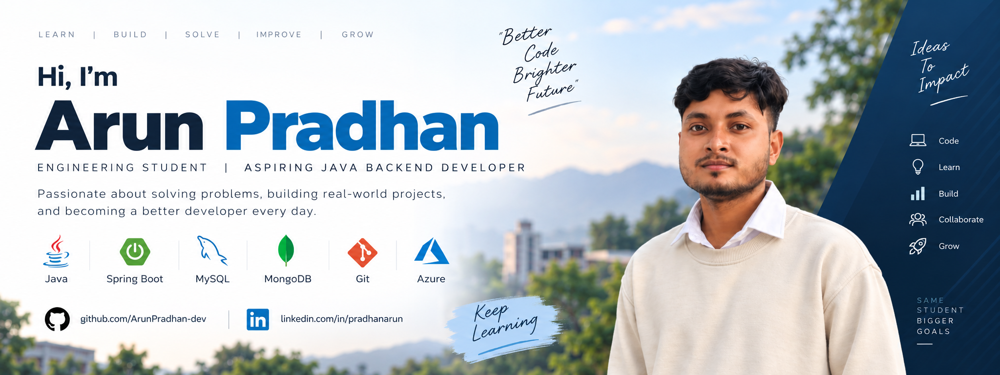

  

🎓 Engineering Student | 💻 Aspiring Java Backend Developer

I'm an engineering student focused on building a strong foundation in **Java, Data Structures & Algorithms, Spring Boot, SQL, and Backend Development**.

I enjoy solving programming problems, building practical projects, and continuously improving my development skills.

## 🛠️ Tech Stack

**Languages**

* Java
* SQL
* JavaScript

**Backend**

* Spring Boot
* Spring MVC
* REST APIs
* Spring Data JPA

**Databases**

* MySQL
* MongoDB

**Tools & Technologies**

* Git
* GitHub
* Maven
* Postman
* IntelliJ IDEA

**Cloud**

* Microsoft Azure

##  Currently Learning

* Data Structures & Algorithms
* Advanced Java
* Spring Boot & REST API Development
* SQL & Database Design
* Backend System Design
* Cloud Deployment with Azure

##  What I'm Working On

* Solving DSA problems regularly
* Building backend projects with Spring Boot
* Improving problem-solving and coding skills
* Learning cloud deployment and development practices

##  GitHub Activity

I use GitHub to document my learning, projects, and coding practice.

##  Career Goal

To start my career as a **Java Backend Developer** and contribute to building reliable, scalable, and maintainable software.

---

⭐ Feel free to explore my repositories and follow my learning journey.
